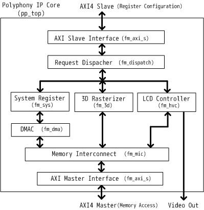
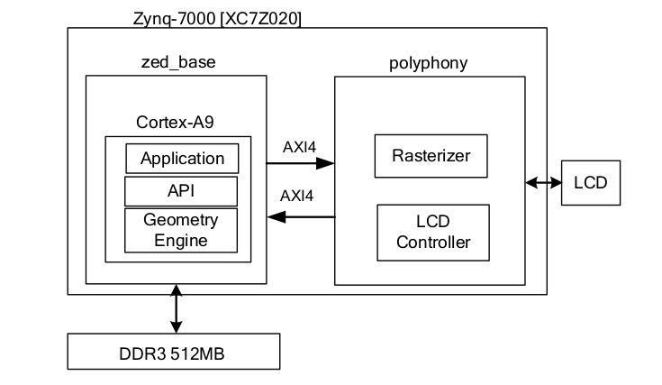
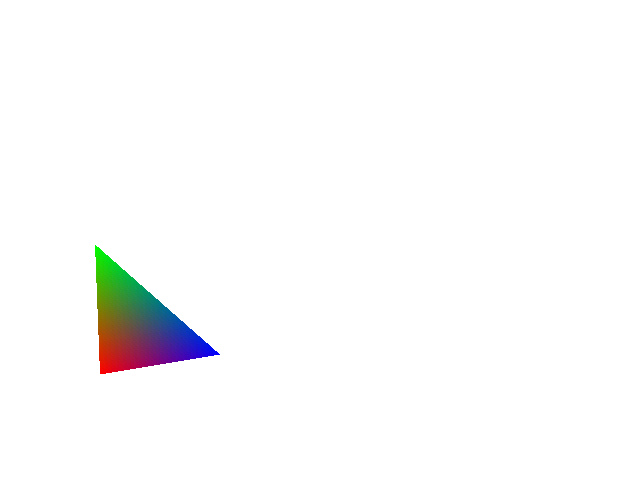
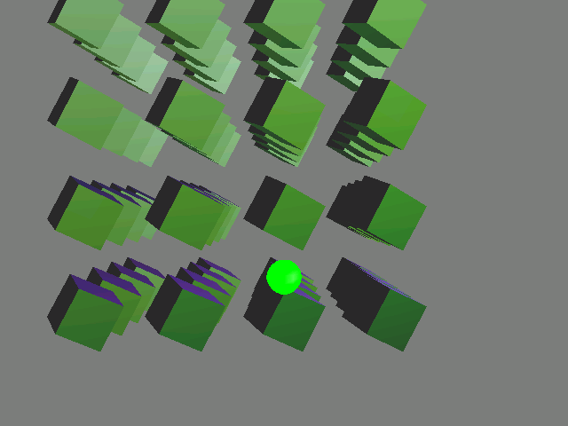
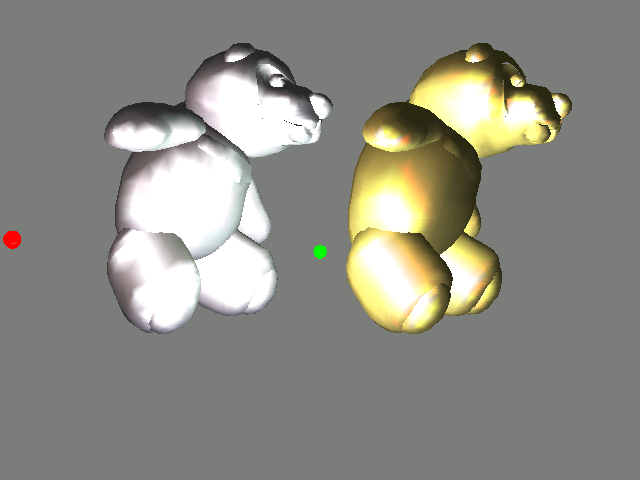
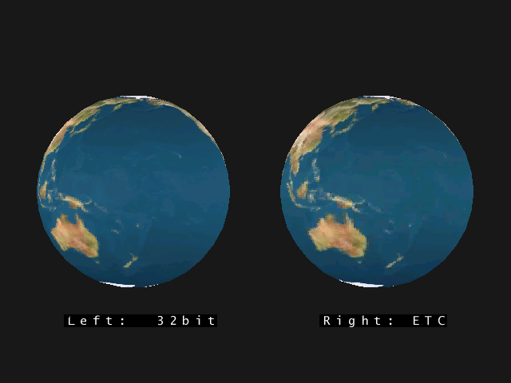
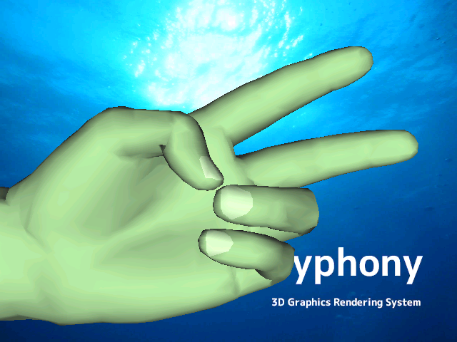

# Polyphony: 3D Graphics Rendering System

## Overview

Polyphony is a 3D graphics rendering system. Rasterizer is written in Verilog, and Geometry Engine is written in C.



- Vendor-independent RTL design.
- Interface: AXI4
- Tested on FPGA boards.
- GLES API is partially implemented.
- Baremetal demo applications.

# FPGA Board
Polyphony is implemented and tested on Zedboard.



# Verilog RTL Simulation

## Tested Environment

OS: CentOS7.8

Verilog Simulator: [Icarus Verilog](https://github.com/steveicarus/iverilog) version 11.0

## Test Scenarios

### simple triangle rendering
```
cd sim_work
../bin/run_iv.sh ../scenario/3d/simple_triangle.v 
```
After finishing the simulation, VGA rendering result(result.bmp) will be generated.


### simple texture-mapped triangle rendering
```
cd sim_work
../bin/run_iv.sh ../scenario/3d/simple_triangle_tex.v 
```
After finishing the simulation, VGA rendering result(result.bmp) will be generated.


# Running the demo on FPGA board
see [ZEDBOARD.md](ZEDBOARD.md)

# Demo applications

## moving lights



## cook-torrance shading model



## texture mapping



## skinning



## anaglyph


# License
This project is licensed under the MIT License - see the LICENSE file for details
## 3D graphics Library Header Files
This design utilizes GL, GLES, and GLU header files below.
- GL
 - gl.h
 - glext.h
- GLES
 - gl.h
 - glext.h
- GLU
 - glu.h
