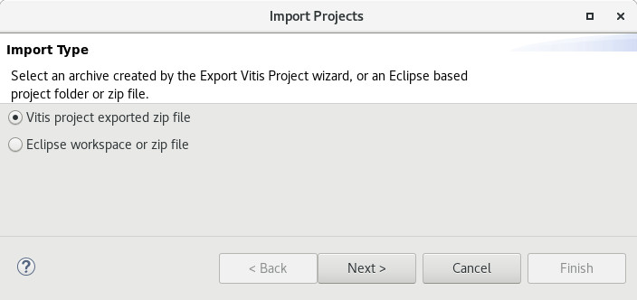
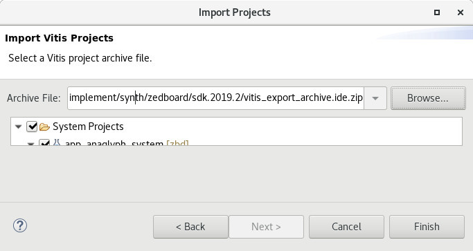
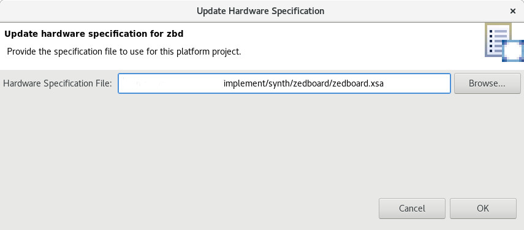
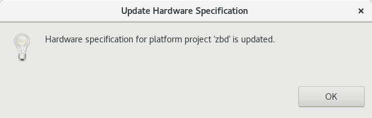
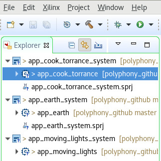
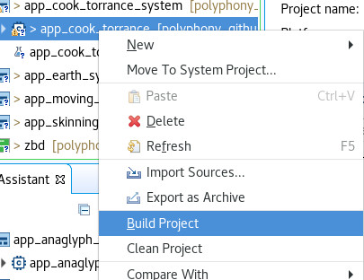
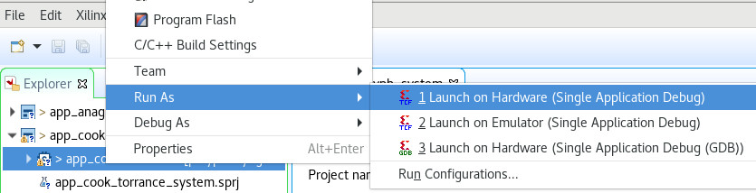

# Running the demo on Zedboad

## Tested Environment
- Target Board: Zedbaord
- Vivado: version 2019.2 on CentOS7.8

## Vivado environment setting

```
$source /path/to/Vivado/2019.2/settings64.sh
```

## .bit generation
Run the following vivado commands in polyphony/implement/synth/zedboard directory. After all commands are finished, zedboard.xsa and zedboard.bit will be generated.

```
$cd implement/synth/zedboard
$vivado -mode batch -source ip.tcl
$vivado -mode batch -source synth.tcl
$vivado -mode batch -source implement.tcl
$vivado -mode batch -source bitgen.tcl
```

## Vitis SDK setup

### Run Vitis

start vitis with -workspace option.

```
$vitis -workspace ./sdk.2019.2
```

### Import projects
Import projects from vitis_archive.ide.zip

1. Select File->Import: Check "Vitis project exported zip file" and click "Next>".



2. Select "vitis_export_archive.ide.zip" as Archive File, then click "Finish"



### Update hardware specification

1. On vitis Explorer panel, select "zbd" platform and click right-button. On the pop-up window, select "Update Hardware Specification".


2. Click "OK".



3. Hardware specification will be updated.



## Run the demo

The following steps run the demo on Zedboard.
1. Power on Zedboard
2. Connect USB program cable and USB serial cable
3. Load .bit to Zedboard

```
cd polyphony/implement/synth/zedboard
$vivado -mode batch -source load_fpga.tcl
```

4. Select a project to be run. The following example selects "app_cook_torrance" project.



5. Build the selected project. Please make sure that the project's Release configuration is active.




6. Run the selected demo. On the built project, right-click. On the Popup-menu, select "Run As->Launch on Hardware.



### (Optional) terminal output
printf output (stdout) is shown via serial port /dev/ttyACM0.
```
$sudo screen /dev/ttyACM0 155200
```
